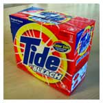

In a previous post I outlined my "another bad idea" for a startup. I had to explain to a few readers that I was being sarcastic as I thought it was actually a very good idea. Since then I've heard some were intrigued by the idea but weren't totally sold on the concept. Here's some more detail on how the re-branding should be part of your next startup.

One of my friends thinks the market needs a simple authenticated online directory. I totally agree and it's a perfect idea that can illustrate how the rebranding of software concept would work. For those who don't know, basically we're talking about an online address book that you have to have a password to use. It would be accessible from any browser on the web and would let you look up phone numbers, email addresses and the like. It might even let you send a quick email to everyone on the list - not as sophisticated as something like a listserv, just some simple group mail stuff.

So who needs such a product? Well, basically any organization that prints a directory. The first candidate I can see are churches. Every church would like to make it easy for members to connect with each other. There is an entire industry around printed pictorial church directories. The branding of this site would appeal to the connectedness offered by an online directory. Pricing would be set for groups sizes that were common in this market.

Now take that core code base and use it for something completely different: family group email addresses. In this application your group might only have one household of members, maybe even just the parents. But with some basic email redirect functions you could set up a parents@ or everyone@ email address that when a message gets sent it is copied and sent onto everyone on the list. I have this at our house and it is great. We use the parents@ address for schools, doctor offices, church, everything - now my wife and I can get mails at the same time as opposed to asking if each other if we saw this or that. Of course this is an entirely different sell and totally different pricing model. Your branding focuses on the hurriedness of everyday life and how this keeps your family organized.

You could do a different version for scouting troops, athletic teams, and even small company affiliate clubs and the like. Each one has different branding, different pricing and a slightly different feature set. And for a lot of reasons they don't have to be connected in any way in the market. When you're not connected in the market your branding can stand alone, and more importantly you don't have to come up with sensible pricing plan that makes sense to all markets; churches pay by the number of members on an annual basis, while families might like a small monthly fee - or free for very limited capabilities.

I cannot better illustrate the importance of disconnected branding than the Disney Company, which of course owns ABC and ESPN. Essentially they find programming and air it through their "channels" with different pricing models (ABC free, ad sponsored, ESPN subscription paid by cable operators - with ad sponsored too). Imagine SportsCenter's audience reaction if it were branded "Disney"; no one would watch it. Okay, I know it was an acquisition but you get the idea.

Another great example is the household liquid soap market. At my grocery store I counted three different manufactures but over a dozen different brands of soap. Basically the only difference was the packaging, the price and the scent. There is another reason why they do this; to consume shelf space thereby locking out more rivals. The internet conceptually has unlimited shelf space but here too I would ask, how many bookmarking sites can you name off the top of your head? If you make it to a dozen you're doing better than the grocery store and soap.

Sadly we are nearing a point where marketing (and branding) will be the single most important thing to get right in the success of a startup. Why not hedge your bet? I say, build it once and sell, resell, resell and resell.
